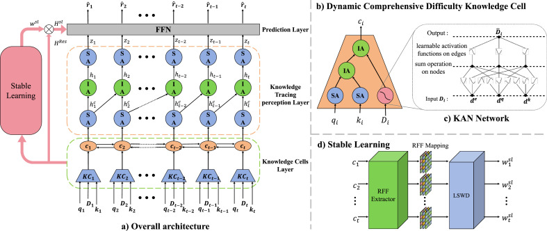

# Dynamic comprehensive Difficulty Knowledge Cells based on KAN Networks and Stable Learning for Knowledge Tracing

**Authors**: *Prof.* Qingtai Hu, *Master* [Qingpeng Wen](mailto:wqp@mail2.gdut.edu.cn), *Dr.* Pengfei Wei, *Pof.* Bi Zeng, *Prof.* Guang Feng, and *Prof.* Liangda Fang.

**Institution**: Guangdong University of Technology, Guangdong Institute of Digital Education, and Jinan University.

**State**: 

Submitted to *Neural Networks* (March 28, 2025); 

Revision submitted to *Neural Networks* (October 13, 2025); 

Accept at *Neural Networks* (December 19, 2025); 

Pre-proof [online](https://doi.org/10.1016/j.neunet.2025.108514) (December 25, 2025).

Published [online](https://doi.org/10.1016/j.neunet.2025.108514) (January1, 2026 [happy new year ^_^ best wishes!]).

For reproducing the implementations of Dynamic comprehensive Difficulty Knowledge Cells (**DDKC**):

## Notes:

The most benchmark *Assistments09* dataset and the corresponding model parameters  are provided in this reproducible project. 

The model parameters on other datasets can be downloaded from here;

> If you just want to reproduce the metrics of this project, please follow the steps in  **setup** and download the model parameters to execute the evaluation (Details in the **Evaluation** section).
>
> If you want to train DDKC,  Please download the dataset and perform training (it may takes some times).

## Architecture



 This work makes the following contributions:

- First propose dynamic comprehensive difficulty in KT domain, which can dynamically update the comprehensive difficulty based on students' evolving knowledge mastery level, and directs to construct **D**ynamic comprehensive **D**ifficulty **K**nowledge **C**ells (**DDKC**), significantly improves the KT model's performance.
- First construct a novel training strategy that utilizes Stable Learning and its training sample weights, which effectively eliminates spurious correlations caused by students’ lucky guesses, focuses more on tracing students' real knowledge states.
- We conduct comprehensive experiments to validate proposed DDKC's performance on several public educational datasets with extensive baselines. Experimental results demonstrate the superiority of DDKC in terms of prediction performance and interpretability, and achieve SOTA prediction performance in all metrics on above datasets.


## Setup

Create a new conda environment, install [PyTorch](https://pytorch.org) and the remaining requirements:
```
conda create  -n ddkc python==3.7
conda activate ddkc
pip install -r requirements.txt
conda install pytorch==1.2.0 torchvision==0.4.0 -c pytorch
```

If you just want to reproduce the DDKC metrics, please jump to the **Evaluation** section.

If you want to reproduce the preprocessing and train DDKC, **download** the data from one of the links above:

- place the main file under `data/<dataset codename>/data.csv` for an ASSISTments dataset
- place the main file under `data/<dataset codename>/data.txt` for a KDDCup dataset

```
python prepare_data.py --dataset <dataset codename> --remove_nan_skills
```

The code supports the following datasets:

- [ASSISTments 2009-2010](https://sites.google.com/site/assistmentsdata/home/assistment-2009-2010-data/skill-builder-data-2009-2010) (assistments09)
- [ASSTSTments 2012](https://sites.google.com/site/assistmentsdata/datasets/2012-13-school-data-with-affect)(assistments12)
- [ASSTSTments 2015](https://sites.google.com/site/assistmentsdata/home)(assistments15)
- [ASSISTments Challenge 2017](https://sites.google.com/view/assistmentsdatamining) (assistments17)
- [Algebra I 2005-2006](https://pslcdatashop.web.cmu.edu/KDDCup/downloads.jsp) (algebra05)
- [NIPS34](https://dqanonymousdata.blob.core.windows.net/neurips-public/data.zip) (nips34)
- [Statics](https://pslcdatashop.web.cmu.edu) (statics)

| Dataset          | #Learners  | #Questions | #Concepts | #Responses | Timestamps | Avg. Comprehensive Difficulty |
| ---------------- | -------- | ------- | -------- | -------------- | ---------- | ----------------------------- |
| assistments09    | 4,217    | 26,688  | 123      | 346,860        | No         | 0.2137                        |
| assistments12    | 29,018    | 53,091  | 265      | 2,711,813        | -         | 0.1615                        |
| assistments15    | 19,917    | 100  | 100      | 708,631        | -         | 0.1007                        |
| assistments17    | 1,079    | 3,162   | 102      | 942,816        | Yes        | 0.1493                        |
| algebra05        | 574      | 210,710 | 112      | 809,694        | Yes        | 0.5788                        |
| nips34           | 4,918    | 948     | 57       | 1,382,727      | Yes       | 0.1941                        |
| statics          | 282      | 1,223   | 98       | 189,297        | No         | 0.4051                              |

## Evaluation

```python
python run.py --dataset <dataset name> --savedir <model savedir> 
```

##### example

If you want to reproduce the DDKC metrics on the Assistments09 dataset, you can use the following command:

```python
python run.py --dataset assistments09 --savedir save/as09
```

## Training

```
python run.py --dataset <dataset name> --eval False
```
##### example

If you want to train the DDKC model on the Assistments09 dataset, use the following command:

```
python run.py --dataset assistments09 --savedir <your savedir>  --eval False
```

## Cite this paper
@article{HU2026108514,
title = {Dynamic comprehensive difficulty knowledge cells based on KAN network and stable learning for knowledge tracing},
journal = {Neural Networks},
volume = {197},
pages = {108514},
year = {2026},
issn = {0893-6080},
doi = {https://doi.org/10.1016/j.neunet.2025.108514},
url = {https://www.sciencedirect.com/science/article/pii/S0893608025013954},
author = {Qintai Hu and Qingpeng Wen and Pengfei Wei and Bi Zeng and Guang Feng and Liangda Fang}
}

Thanks for your citing our works!
